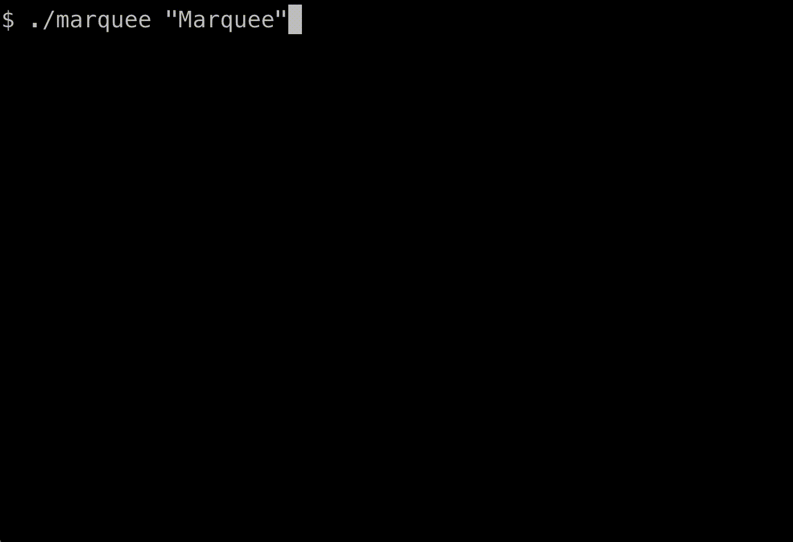

# [marquee](https://github.com/agtkh/marquee)

A command-line tool to scroll multi-line text and ASCII art across your terminal.



## Features

-   **Multi-line Support**: Scrolls entire blocks of text, like ASCII art, while preserving the layout.
-   **ANSI Color Parsing**: Correctly interprets and displays embedded ANSI color codes from the input.
-   **Customizable Animation**: Control the scroll direction, speed, and number of repetitions.
-   **Flexible Input**: Accepts text from command-line arguments or piped from stdin.
-   **Advanced Options**: Includes long options (e.g., `--count`), flexible argument order, and an `sl`-inspired "accident" mode that ignores interrupts.

## Installation

Follow these steps to clone and compile the project.

**1. Clone the repository**
```bash
git clone https://github.com/agtkh/marquee.git
cd marquee
```

**2. Install Dependencies**
You will need a C compiler (`gcc` or `clang`), `make`, and the `ncurses` development library.

* **On Debian / Ubuntu:**
    ```bash
    sudo apt update
    sudo apt install build-essential libncurses-dev
    ```

* **On Red Hat / CentOS / Rocky Linux:**
    ```bash
    sudo yum groupinstall "Development Tools"
    sudo yum install ncurses-devel
    ```

* **On macOS (using Homebrew):**
    ```bash
    # Install Command Line Tools if you haven't already
    xcode-select --install

    # Install ncurses via Homebrew
    brew install ncurses
    ```

**3. Compile**
Simply run `make` in the project directory.
```bash
make
```
The executable `marquee` will be created in the current directory.

## Usage

The program's help message provides a complete list of options.
```
$ ./marquee --help

Usage: ./marquee [text...] [OPTIONS]

Displays multi-line text as a scrolling marquee in the terminal.
Text can be provided as arguments (use $'...' for newlines), or piped via stdin.

OPTIONS:
  -c, --count <n>      Scroll <n> times. (Default: 1)
  -s, --speed <usec>   Set animation delay in microseconds. (Default: 100000)
  -r, --reverse        Scroll from left to right.
  -l, --loop           Scroll infinitely.
  -a, --accident       Ignore Ctrl-C interruptions.
  -h, --help           Display this help message and exit.
```

## Examples

Here are more examples demonstrating the different ways you can use `marquee`.

### 1. Scrolling Simple Text

The most basic usage: scrolling text once from right to left (default behavior).

**Command:**
```bash
./marquee "Hello, terminal!"
```
**Expected Behavior:** The phrase "Hello, terminal!" will scroll across your terminal from the right edge to the left and then the program will exit.

### 2. Looping Text with Adjusted Speed

Use the `--loop` option (`-l`) to make the text scroll continuously, and `--speed` (`-s`) to control the delay between steps (in microseconds).

**Command:**
```bash
./marquee --loop --speed 150000 "Scrolling slowly and continuously..."
```
**Expected Behavior:** The text will scroll from right to left repeatedly at a slightly slower pace. You'll need to press `q` to exit.

### 3. Scrolling from Left to Right

The `--reverse` option (`-r`) changes the scrolling direction.

**Command:**
```bash
./marquee --loop --reverse "Moving from left to right"
```
**Expected Behavior:** The text will scroll from the left edge of your terminal to the right repeatedly. Press `q` to stop.

### 4. Scrolling Multiple Times

The `--count` option (`-c`) specifies how many times the text should scroll across the screen.

**Command:**
```bash
./marquee --count 2 "Scroll twice"
```
**Expected Behavior:** The phrase "Scroll twice" will scroll from right to left two times, and then the program will automatically exit.

### 5. Using Multi-line Text from Arguments

You can use the `$''` syntax in your shell to provide multi-line text as a command-line argument.

**Command:**
```bash
./marquee $'First Line\n  Second Line\nThird Line' --loop
```
**Expected Behavior:** The three lines of text will scroll together as a block from right to left continuously. Press `q` to exit.

### 6. Displaying Colored Text

If your terminal supports ANSI escape codes for colors, `marquee` will interpret them.

**Command:**
```bash
echo -e "\x1b[31mRed Text\x1b[0m and \x1b[32mGreen Text\x1b[0m" | ./marquee --loop
```
**Expected Behavior:** The text will scroll with "Red Text" displayed in red and "Green Text" in green. Press `q` to stop.

### 7. Scrolling ASCII Art with Controlled Speed

Combine multi-line input (often from tools like `figlet`) with speed control.

**Command:**
```bash
figlet -f banner "MARQUEE" | ./marquee --loop --speed 180000
```
**Expected Behavior:** The large ASCII art banner for "MARQUEE" will scroll from right to left repeatedly at a slower speed. Press `q` to exit.

### 8. Ignoring Interrupts (Accident Mode)

The `--accident` option (`-a`) makes the program ignore `Ctrl+C` interrupts for the duration of one scroll. This is a playful nod to the `sl` command.

**Command:**
```bash
./marquee --accident "Try to stop me with Ctrl-C!"
```
**Expected Behavior:** The text will scroll once from right to left. During the scroll, pressing `Ctrl+C` will have no effect. The program will exit automatically after the scroll is complete.

## License

This project is licensed under the MIT License. See the [LICENSE](LICENSE) file for details.
